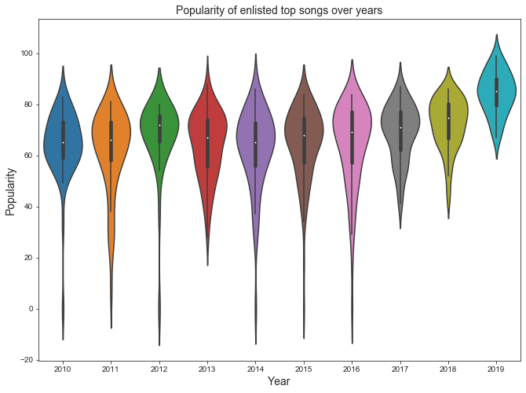
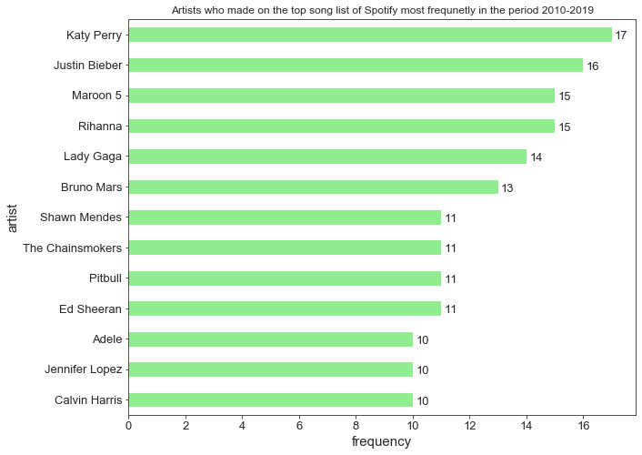
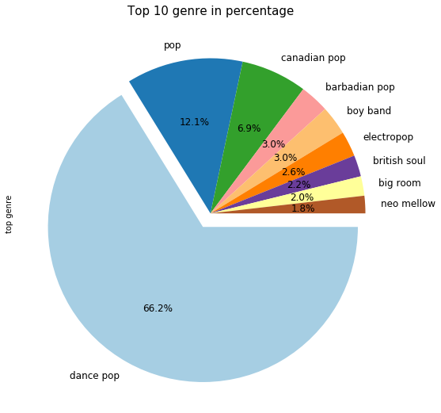
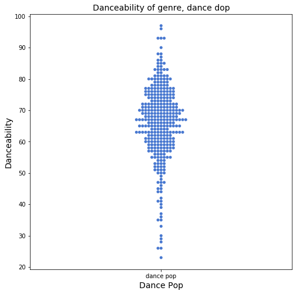
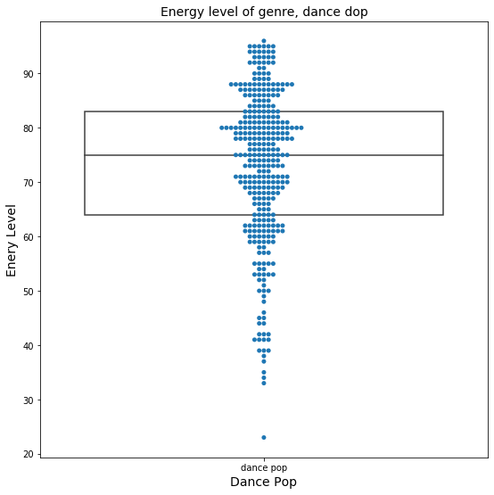
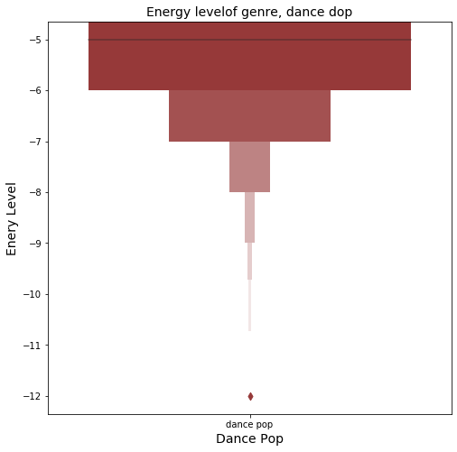
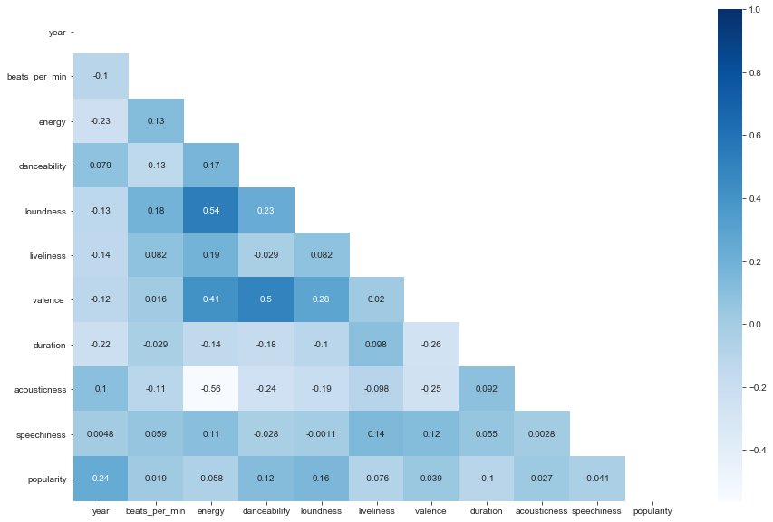

## Exploratory Data Analysis (EDA) on spotify top listed songs from 2010 to 2019
**Saiful Hasan [LinkedIn](https://www.linkedin.com/in/saifulhasan22/) [Website](https://saifulhasanchayan.wixsite.com/portfolio)** 

According to Spotify’s first quarter 2020 report, they have around 286 million monthly active users. Among them, 130 million were Spotify Premium subscribers. Both the numbers are higher than the fourth-quarter report 2019 when there were 271 monthly active Spotify users and 124 million Spotify Premium subscribers. These numbers are enough to give us an idea of why Spotify is the world’s biggest music streaming platform by the number of subscribers.

Recently, from Kaggle, I have got a large dataset of Spotify’s top listed songs from 2010 to 2019. With a curious to derive some insights from the data, I did some preliminary exploratory data analysis (EDA). EDA is an approach; we data scientists, researchers sometimes go through to summarize the main characteristics of the data. It is widespread to use visual methods in EDA to represent the insights to the non-technical audience in more straightforward ways. EDA helps us to explore what our data could tell us beyond the formal modeling or hypothesis testing task.

Before I get into more of the exploratory data analysis, It is required to know a little bit of the data, and it starts with a data dictionary, which represents brief descriptions of the features we would consider to explore.

*To see my coding please visit to the notebook named 'code' from the directory.*

#### Data Dictionary
|__Feature__|__Description__|
|:---|:---|
|`title`|__The title of the songs.__|
|`top genre`|__The genre of the songs.__|
|`artist`|__The artist (name) of the songs.__|
|`year`|__Song's year in the Billboard.__|
|`beats_per_min`|__Beats per minute - this measures the tempo of the song.__|
|`energy`|__It represents a perceptual measure of intensity and activity. The energy of a song - the higher the value, the more energtic the song. Typically, energetic songs feel fast, loud, and noisy. For instance, death metal has high energy, while a Bach prelude scores low on the scale.__|
|`danceability`|__It is a measure using a mixture of song features such as beat strength, tempo stability, and overall tempo. The higher the value, the easier it is to dance to the song.__|
|`loudness`|__It represents the overall loudness of a track in decibels (dB). The loudness values are averaged across the entire song. The higher the value, the louder the song.__|
|`liveness`|__The higher the value, the more likely the song is a live recording.__|
|`valence`|__The higher the value, the more positive mood for the song (e.g. happy, cheerful, euphoric) and the lower the value the more negative (or less positive) mood for the song ( e.g. sad, depression, angry). It refers the musical positiveness conveyed by a song.__|
|`duration`|__The length or duration of the song.__|
|`acousticness`|__A confidence measure from 0.0 to 1.0 of whether the song is acoustic. The higher the value, the more acoustic the song__|
|`speechiness`|__This is a measure to detect the presence of spoken words in a song. The more exclusively speech-like the recording (e.g. talk show, audio book, poetry), the closer to 1.0 the attribute value. Thus, the higher the value the more spoken word the song contains.__|
|`popularity`|__The higher the value, the more popular the song__|

*Reference : [Ashrith](https://towardsdatascience.com/what-makes-a-song-likeable-dbfdb7abe404), [Kaggle](https://www.kaggle.com/leonardopena/top-spotify-songs-from-20102019-by-year)*

#### Exploratory Data Analysis 

**For most of the years, the average popularity scores were between 60-70, while in 2019, it has the highest popularity score of around 85.**

###### ***some quick overview of the listed songs between 2010 and 2019***
- **Highest beats per minutes:** song title - **'Rihanna'** and artist - **'FourFiveSeconds'**
- **Highest energy:** song title - **'Jonas Brothers'** and artist - **'Pom Poms'**
- **Highest liveliness:** song title - **'Meghan Trainor'** and artist - **'NO'**
- **Highest acousticness:** song title - **'John Legend'** and artist - **'Start'**
- **Highest danceability:** song title - **'Cardi B'** and artist - **'Drip (feat. Migos)'**

- **Lowest beats per minutes:** song title - **'Adele'** and artist - **'Million Years Ago'**
- **Lowest energy:** song title - **'Adele'** and artist - **'Million Years Ago'**
- **Lowest liveliness:** song title - **'Adele'** and artist - **'Million Years Ago'**
- **Lowest acousticness:** song title - **'Katy Perry'** and artist - **'Last Friday Night (T.G.I.F.)'**
- **Lowest danceability:** song title - **'Adele'** and artist - **'Million Years Ago'**

**Katy Perry** has most number of top songs on Spotify in the period of 2010-19 followed by **Justin Bieber**. **Rihanna** and **Maroon 5** both appreaded 15 times on the top song lists of Spotify between 2010-2019. 

###### ***The songs of Kety perry made to the top song list on Spotify during 2010-2019***
- 'Teenage Dream',
-  'California Gurls',
-  'E.T.',
-  'Last Friday Night (T.G.I.F.)',
-  'Firework',
-  'Part Of Me',
-  'Wide Awake',
-  'The One That Got Away',
-  'Roar',
-  'Dark Horse',
-  'This Is How We Do',
-  'Birthday',
-  'Legendary Lovers',
-  'Rise',
-  'Swish Swish',
-  'Chained To The Rhythm',
-  'Bon appétit'

###### ***Detail of top listed songs of Katy Perry***
- average danceability: **65.71**
- average liveliness: **21.0**
- average energy: **75.94**
- average beats_per_min: **132.24**
- average duration: **224.18**
- average acusticness: **3.88**
- average popularity: **62.12**
- average speechiness: **6.41**

We noticed that in last 10 years majority of the top listed songs were **dance pop**. It posses about **66% of all listed songs**. 

We see that the danceability of the dance pop songs is **usually between 60 to 80 with an average of around 65 which is relatable.**

We see that the energy level of dance pop song is usually **between around 65 and 80, with an average of 73.**

We see that majority of dance pop songs have **loudness below -7.**

**Escape room** genre has the highest average popularity followed by **brostep**. However, the reason these have higher average popularity score is there are very few songs of these genre, such as escpae room, brosteps, alternative r&b. **Appreanetly only 2 songs of escape room genre made to the top list over last 10 years and only one song for alternative r&b genre.*

The correlation chart suggests that there is a very weak correlation between popularity and other features. So it is recommended that different features might be playing a role to determine the popularity score. There is a moderate strength correlation between loudness and energy, as well as valence and energy, which makes sense. There is also a moderate strength correlation between valence and danceability, which also makes sense. 

#### Data Reference:
This data was collected from kaggle. The link is given below:
- https://www.kaggle.com/leonardopena/top-spotify-songs-from-20102019-by-year
- the data was uploaded by Leonardo Henrique on Kaggle   