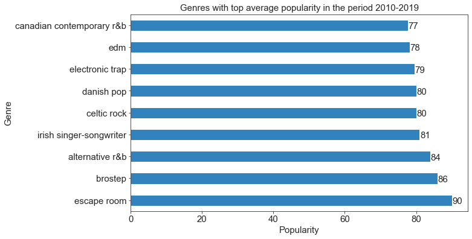

## Exploratory Data Analysis (EDA) on spotify top listed songs from 2010 to 2019
**Saiful Hasan [LinkedIn](https://www.linkedin.com/in/saifulhasan22/)** 

#### Data Dictionary
|__Feature__|__Description__|
|:---|:---|
|`title`|__The title of the songs__|
|`top genre`|__The genre of the songs__|
|`artist`|__The Artist of the songs__|
|`year`|__Song's year in the Billboard__|
|`beats_per_min`|__Beats.Per.Minute - The tempo of the song.__|
|`energy`|__The energy of a song - the higher the value, the more energtic. song__|
|`danceabilityr`|__The higher the value, the easier it is to dance to this song__|
|`loudness`|__The higher the value, the louder the song__|
|`liveness`|__The higher the value, the more likely the song is a live recording__|
|`valence`|__The higher the value, the more positive mood for the song__|
|`duration`|__The length of the song__|
|`acousticness`|__The higher the value the more acoustic the song is__|
|`speechiness`|__The higher the value the more spoken word the song contains__|
|`popularity`|__The higher the value the more popular the song is__|

#### Exploratory Data Analysis 

**For most of the years, the average popularity scores were between 60-70, while in 2019, it has the highest popularity score of around 85.**

###### ***some quick overview of the listed songs between 2010 and 2019***
- Highest beats per minutes song title:'Rihanna' and artist: 'FourFiveSeconds'
- Highest energy song title:'Jonas Brothers' and artist: 'Pom Poms'
- Highest liveliness song title:'Meghan Trainor' and artist: 'NO'
- Highest acousticness song title:'John Legend' and artist: 'Start']
- Highest danceability song title:'Cardi B' and artist: 'Drip (feat. Migos)'

- Lowest beats per minutes song title:'Adele' and artist: 'Million Years Ago'
- Lowest energy song title:'Adele' and artist: 'Million Years Ago'
- Lowest liveliness song title:'Adele' and artist: 'Million Years Ago'
- Lowest acousticness song title:'Katy Perry' and artist: 'Last Friday Night (T.G.I.F.)'
- Lowest danceability song title:'Adele' and artist: 'Million Years Ago'

**Katy Perry** has most number of top songs on Spotify in the period of 2010-19 followed by **Justin Bieber**. **Rihanna** and **Maroon 5** both appreaded 15 times on the top song lists of Spotify between 2010-2019. 

###### ***The songs of Kety perry made to the top song list on Spotify during 2010-2019***
- 'Teenage Dream',
-  'California Gurls',
-  'E.T.',
-  'Last Friday Night (T.G.I.F.)',
-  'Firework',
-  'Part Of Me',
-  'Wide Awake',
-  'The One That Got Away',
-  'Roar',
-  'Dark Horse',
-  'This Is How We Do',
-  'Birthday',
-  'Legendary Lovers',
-  'Rise',
-  'Swish Swish',
-  'Chained To The Rhythm',
-  'Bon appétit'

###### ***Detail of top listed songs of Katy Perry***
- average danceability: 65.71
- average liveliness: 21.0
- average energy: 75.94
- average beats_per_min: 132.24
- average duration: 224.18
- average acusticness: 3.88
- average popularity: 62.12
- average speechiness: 6.41

We noticed that in last 10 years majority of the top listed songs were **dance pop**. It posses about **66% of all listed songs**. 

We see that the danceability of the dance pop songs is **usually between 60 to 80 with an average of around 65 which is relatable.**

We see that the energy level of dance pop song is usually **between around 65 and 80, with an average of 73.**

We see that majority of dance pop songs have **loudness below -7.**

**Escape room** genre has the highest average popularity followed by **brostep**. However, the reason these have higher average popularity score is there are very few songs of these genre, such as escpae room, brosteps, alternative r&b. **Appreanetly only 2 songs of escape room genre made to the top list over last 10 years and only one song for alternative r&b genre.*

The correlation chart suggests that there is a very weak correlation between popularity and other features. So it is recommended that different features might be playing a role to determine the popularity score. There is a moderate strength correlation between loudness and energy, as well as valence and energy, which makes sense. There is also a moderate strength correlation between valence and danceability, which also makes sense. 

#### Data Reference:
This data was collected from kaggle. The link is given below:
- https://www.kaggle.com/leonardopena/top-spotify-songs-from-20102019-by-year
- the data was uploaded by Leonardo Henrique on Kaggle   